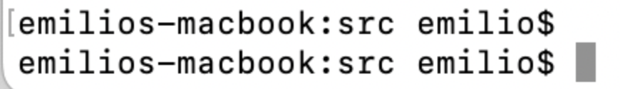
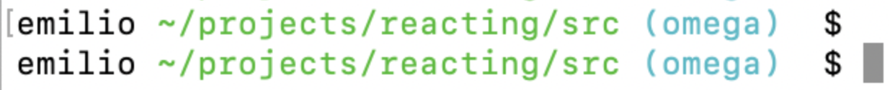

## Minimalistic bash theme

Some people have enjoyed using my minimalistic bash theme, so I thought I would share it. 

There is a whole world of shell customization out there such as [ohmyzsh](https://ohmyz.sh/) and my favorite, [fish](https://fishshell.com/). 

However, most of them are overbuilt for new developers. This bash profile has the basics. It shows your device name, what path you are in, and your git branch. No more. No less.

This is what it looks like before you change your bash theme (not as usable):

and after adding my custom profile:

### This is how you make it work if you've never done this before. 

1. Navigate to your root directory `cd ~`
2. If you have an existing bash profile, open it with `open .bash_profile` or create one with `touch .bash_profile` and then open it.
3. Copy the contents of the `bashprofile` document in this repo
4. Save the document
5. Now return to your terminal and type in `source .bash_profile` to make sure it's active. Open a new terminal using `CMD+t` to see the applied changes. Happy hacking!

